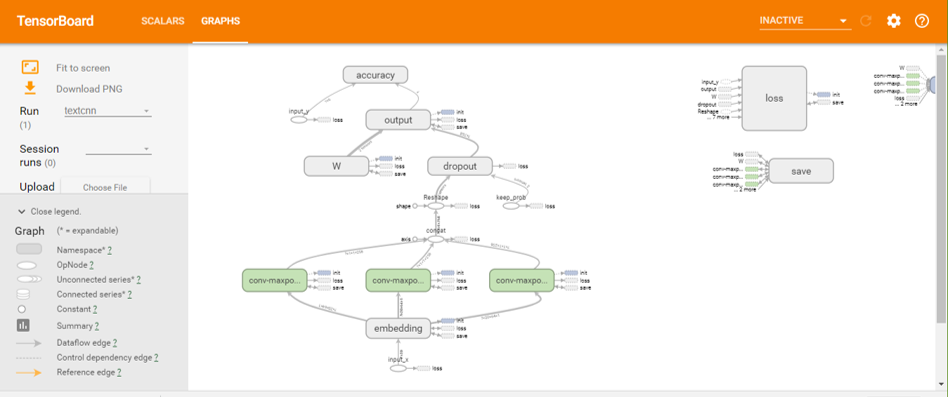
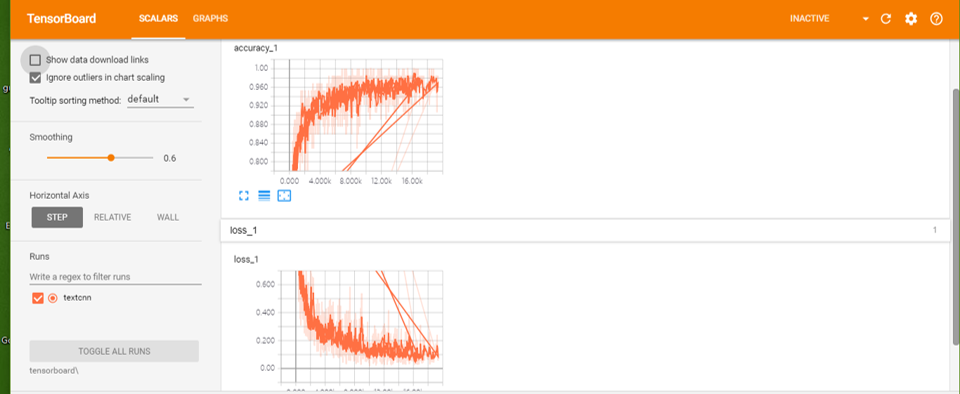

# Text Classification with CNN and RNN

使用神经网络进行中文文本分类

本文是基于TensorFlow在中文短文本数据集上的简化实现，使用了词级CNN和RNN对中文文本进行分类，达到了较好的效果。


## 环境

- Python 2/3
- TensorFlow 1.3以上
- numpy
- scikit-learn
- scipy

## 数据集

爬取某东的商品列表，并从中提取出商品标题短文本以及对应类别。当然也可使用其他开源数据集，如：使用THUCNews的一个子集进行训练与测试，数据集请自行到[THUCTC：一个高效的中文文本分类工具包](http://thuctc.thunlp.org/)下载，请遵循数据提供方的开源协议

**爬取商品标题及其分类**


本次训练使用了其中的10个分类，每个分类20000条数据。

类别如下：

```
'服饰内衣', '图书', '汽车用品', '运动户外', '家装建材', '礼品箱包', '电脑、办公', '家具', '母婴', '鞋靴'
```

预处理完的数据可以在此下载：链接:  
https://drive.google.com/open?id=1pIzxZQfV7cajS2pv0wW_XIoN9a2AHyUR

数据集划分如下：

- 训练集: 98%
- 验证集: 1%
- 测试集: 1%


## 预处理

`data/pre_process.py`为数据的预处理文件。

- `read_file()`: 读取文件数据;
- `build_vocab()`: 构建词汇表，使用词级的表示，这一函数会将词汇表存储下来，避免每一次重复处理;
- `read_vocab()`: 读取上一步存储的词汇表，转换为`{词：id}`表示;
- `read_category()`: 将分类目录固定，转换为`{类别: id}`表示;
- `to_words()`: 将一条由id表示的数据重新转换为文字;
- `preocess_file()`: 将数据集从文字转换为固定长度的id序列表示;
- `batch_iter()`: 为神经网络的训练准备经过shuffle的批次的数据。
> 词向量使用预先训练好的300d  
https://github.com/Embedding/Chinese-Word-Vectors

> 预处理前词云展示
<p align="center">
> 分词、去停用词、去数字(非关键)后
<p align="center">

经过数据预处理，batch_iter数据的格式如下：

| Data | Shape | Data | Shape |
| :---------- | :---------- | :---------- | :---------- |
| x_train | [?, 300] | y_train | [?, 10] |
| x_val | [?, 300] | y_val | [?, 10] |
| x_test | [?, 300] | y_test | [?, 10] |

## CNN卷积神经网络

### 配置项

CNN可配置的参数如下所示，在`cnn_model.py`中。

```python
class TNNConfig(object):
    """NN配置参数"""
    def __init__(self,nn):
        self.nn=nn
    embedding_dim = 300  # 词向量维度
    seq_length = 40  # 序列长度
    num_classes = 10  # 类别数
    num_filters = 256  # 卷积核数目
    kernel_size = 5  # 卷积核尺寸
    vocab_size = 5000  # 词汇表达小
    filter_sizes=(2,3,4)

    hidden_dim = 128  # 全连接层神经元

    dropout_keep_prob = 0.5  # dropout保留比例
    learning_rate = 1e-3  # 学习率

    batch_size = 64  # 每批训练大小
    num_epochs = 10  # 总迭代轮次

    print_per_batch = 100  # 每多少轮输出一次结果
    save_per_batch = 10  # 每多少轮存入tensorboard
    l2_reg_lambda=0.0

    num_layers = 2  # 隐藏层层数
    rnn = 'gru'  # lstm 或 gru
```

### NN模型

具体参看`nn_model.py`的实现。

大致结构如下：



### 训练与验证

运行 `python run_nn.py train cnn`，可以开始训练。

> 若之前进行过训练，请把tensorboard/textcnn删除，避免TensorBoard多次训练结果重叠。

```
Iter:  14500, Train Loss:  0.021, Train Acc: 100.00%, Val Loss:  0.069, Val Acc:  98.04%, Time: 0:27:23
No optimization for a long time, auto-stopping...
Test Loss:  0.065, Test Acc:  98.06%
```
在验证集上的最佳效果为98.04%，且只经过了5轮迭代就已经停止。

准确率和误差如图所示：



### 参数数量

```python
INPUT:   [20x300x1]   memory: 20*300  =6K       weight:0
CONV2-1: [2x300x1]    memory: 2x300   =0.6K     weight=2*300=900
CONV2-1: [2x300x1]    memory: 2x300   =0.6K     weight=2*300=900
POOL2:   [1x19]       memory: 1x19    =0.019K   weight=0
CONV2-1: [3x300x1]    memory: 3x300   =0.9K     weight=3*300=900
CONV2-1: [3x300x1]    memory: 3x300   =0.9K     weight=3*300=900
POOL2:   [1x18]       memory: 1x18    =0.018K   weight=0
CONV2-1: [4x300x1]    memory: 4x300   =1.2K     weight=4*300=1200
CONV2-1: [4x300x1]    memory: 4x300   =1.2K     weight=4*300=1200
POOL2:   [1x17]       memory: 1x17    =0.017K   weight=0
FC:      [1*128]      memory: 128               weight:768x128=98304
```
>FC层占了绝大部分的参数 可以通过GAP进行优化      **todo**

还可以通过进一步的调节参数，来达到更好的效果。

**Todolist**
 - [Attention]
 - [Transformer]

## reference


Mikolov T, Chen K, Corrado G, et al. [Efficient estimation of word representations in vector space](https://arxiv.org/abs/1301.3781)  
[2]	Kim Y. [Convolutional neural networks for sentence classification](https://arxiv.org/abs/1408.5882)  
[3]	Lai S, Xu L, Liu K, et al. [Recurrent Convolutional Neural Networks for Text Classification](https://www.aaai.org/ocs/index.php/AAAI/AAAI15/paper/view/9745)
[4]	Yang Z, Yang D, Dyer C, et al. [Hierarchical attention networks for document classification](http://www.aclweb.org/anthology/N16-1174)
[5]	Vaswani A, Shazeer N, Parmar N, et al. [Attention is all you need](https://arxiv.org/abs/1706.03762)  
[6]	Joulin A, Grave E, Bojanowski P, et al. [Bag of tricks for efficient text classification](https://arxiv.org/abs/1607.01759)  
[7]	Kalchbrenner N, Grefenstette E, Blunsom P. [A convolutional neural network for modelling sentences](https://arxiv.org/abs/1404.2188)  
[8] [textcnn github ](https://github.com/gaussic/text-classification-cnn-rnn)  
[9] [qingson's zhihu](https://zhuanlan.zhihu.com/p/25928551)  
[10] [Implementing a CNN for Text Classification in TensorFlow](http://www.wildml.com/2015/12/implementing-a-cnn-for-text-classification-in-tensorflow/)  
[11] [Character-level Convolutional Networks for Text Classification](https://arxiv.org/abs/1509.01626)
